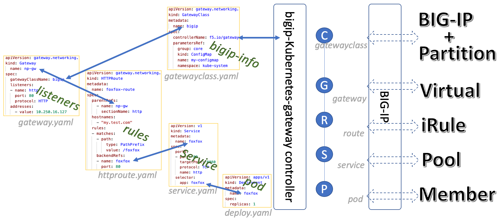
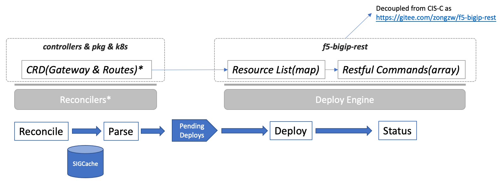

# Overview

This project is one kind of Gateway API downstream implementations and integrations.

It leverages the Kubernetes development kit [Operator pattern](https://kubernetes.io/docs/concepts/extend-kubernetes/operator/){:target="_blank"} and [Controllers](https://kubernetes.io/docs/concepts/architecture/controller/){:target="_blank"} for the implementation. 

## Resource Correspondence to BIG-IP Provider

The correspondence between gateway-related resources and BIG-IP resources is as follows:

From the above figure, we can see the correspondence between gateway-related resources and resources on BIG-IP.

When using BIG-IP as a provider, the specific form of each gateway resource on BIG-IP is:

| K8S Resources      | BIG-IP Resources |
| :---: | :---: |
|`Controller` | BIG-IP Device |
| `GatewayClass`      |  `Partition`       |
| `Gateway`   | `Virtual`        |
|`HTTPRoute`| `iRule`|
|`Service`|`Pool`|
|`Deploy`(`pods`)|`Member`|

## Program Architecture and Workflow Design

Basically, bigip-kubernetes-gateway architecture is designed as follows:

* It uses `controller-runtime` framework to connect to the k8s cluster side and receive user operation events on various resources such as `GatewayClass`, `Gateway`, `HTTPRoute`, `Service`, etc.
* It uses [`f5-bigip-rest`](https://gitee.com/zongzw/f5-bigip-rest) module to do resource deliveries and deployments to BIG-IP via iControl REST.
* Between the upstream and downstream, it uses a queue to decouple event processing and delivery logic.

