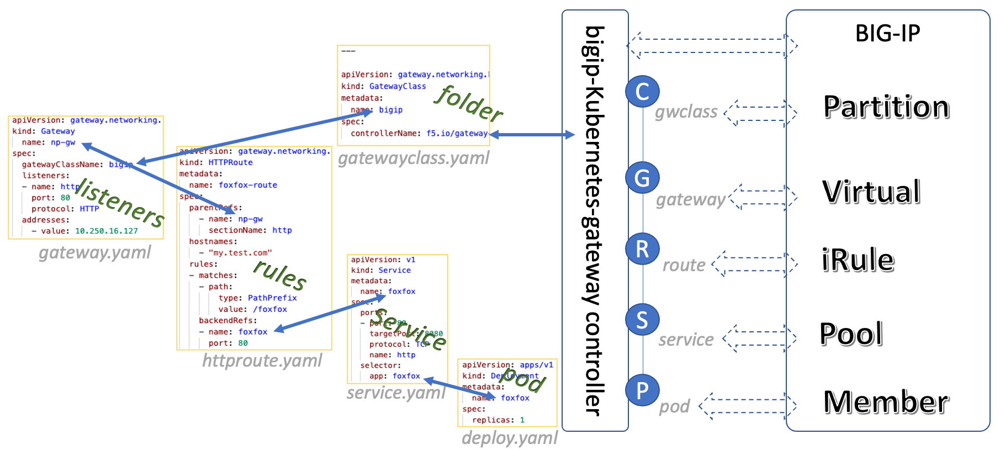

# Overview

BIG-IP Kubernetes GatewayAPI Controller ("Controller" in short) is one of GatewayAPI downstream [implementations](https://gateway-api.sigs.k8s.io/implementations/){:target="_blank"}.

The Controller is responsible for resolving 2 problems,

* Automatical application deliveries on downstream BIG-IP instance(s).
* Network connectivity setup between Kubernetes CNI and BIG-IP(s) traffic network.

## Resource Monitoring

Like all other CRD implementations, the Controller monitors Kubernetes GatewayAPI CRD resources (gateway.networking.k8s.io/v1beta1) and converts them to BIG-IP-related configurations for deploying to BIG-IP devices.

The Controller connects to the upstream Kubernetes, monitors Gateway API updating events from the cluster through the list-watch mechanism. The mechanism was encapsulated in `client-go`(k8s.io/client-go) and `controller-runtime`(sigs.k8s.io/controller-runtime).

In order to access various necessary resources of Kubernetes, we need to use specific `ServiceAccount` and `ClusterRole` that have specific permissions. Please refer to [installation guide](../guides/getstarted.md) for permission details.

## Resource Mapping

The Controller connects to the downstream BIG-IP to parse, convert and deploy the Gateway API configuration to BIG-IP as ADC resources. 

The correspondence between GatewayAPI resources and BIG-IP resources is as follows:

We can see that, with BIG-IP as a provider, the specific form of each gateway resource on BIG-IP is:

| K8S Resources      | BIG-IP Resources |
| :---: | :---: |
|`Controller` | BIG-IP Device |
| `GatewayClass`      |  `Partition`       |
| `Gateway`   | `Virtual`        |
|`HTTPRoute`| `iRule`|
|`Service`|`Pool`|
|`Deploy`(`pods`)|`Member`|

## Networking Enablement

In term of network connectivity, as we know, Kubernetes has different CNI types, like flannel(overlay), calico(underlay), etc.

For overlay network, the Controller setup the tunnel between BIG-IP traffic network and Kubernetes network, also, make the new deployed `Service` to be discovered(setup the fdb/arp) on BIG-IP, so that the North-south traffic can go through.

For underlay network, the Controller setups the BGP neighbors for discoveries to any service deployment.

Notes that, all the networking setup should be automatic. The controller is responsible for network enablement along with BIG-IP resources’ deployment.

## Deploying Methods

BIG-IP provides a variety of Configuration Utilities, such as AS3, iControl Rest, tmsh.

In Controller, we currently use iControl Rest to assemble the list of deployed resources through transactions, and use incremental way to achieve the deployments, this process is encapsulated as BIG-IP iControl Rest golang module. It is characterized by incremental, fast, self-discovery of BIG-IP resource status.

Of course, using AS3 is another possibility. AS3 is F5 recommended way to do ADC deployment to BIG-IP. In the future, AS3 will be the only external configuration utility for BIG-IP Next product. We will continuously check its performance, integrate it into the Controller at the right time and in the right way.

