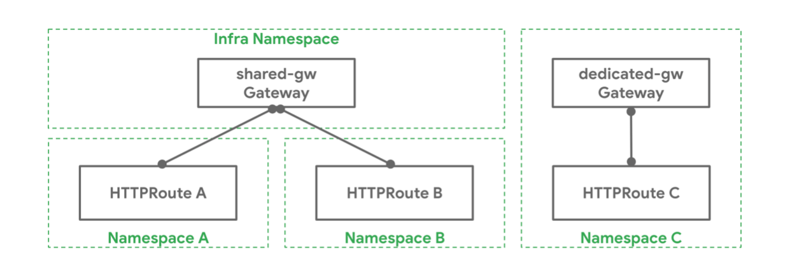

# Route Resources
Route resources define protocol-specific rules for mapping requests from a Gateway to Kubernetes Services.
As of 0.5.1, four Route resource types are included with the API. Custom Route types that are implementation-specific are encouraged for other protocols. New route types may be added to the API in future.

# HTTPRoute
HTTPRoute is for multiplexing HTTP or terminated HTTPS connections. It's intended for use in cases where you want to inspect the HTTP stream and use HTTP request data for either routing or modification, for example using HTTP Headers for routing, or modifying them in-flight.

# Route summary table
The "Routing Discriminator" column below refers to what information can be used to allow multiple Routes to share ports on the Listener.

|Object | OSI Layer | Routing Discriminator | TLS Support | Purpose |
| --- | --- | --- | --- | -- |
| HTTPRoute | Layer 7 | Anything in the HTTP Protocol | Terminated only | HTTP and HTTPS Routing |
| TLSRoute | Somewhere between layer 4 and 7 | SNI or other TLS properties | Passthrough or Terminated | Routing of TLS protocols including HTTPS where inspection of the HTTP stream is not required. |
| TCPRoute | Layer 4 | destination port | Passthrough or Terminated | Allows for forwarding of a TCP stream from the Listener to the Backends |
| UDPRoute | Layer 4 | destination port | None | Allows for forwarding of a UDP stream from the Listener to the Backends. |
| GRPCRoute | Layer 7 | Anything in the gRPC Protocol | Terminated only | gRPC Routing over HTTP/2 and HTTP/2 cleartext |

When a Route attaches to a Gateway, it represents configuration that is applied on the Gateway that configures the underlying load balancer or proxy. How and which Routes attach to Gateways is controlled by the resources themselves. Route and Gateway resources have built-in controls to permit or constrain how they are attached. Together with Kubernetes RBAC, these allow organizations to enforce policies for how Routes are exposed and on which Gateways.

There is a lot of flexibility in how Routes can attach to Gateways to achieve different organizational policies and scopes of responsibility. These are different relationships that Gateways and Routes can have:

•	One-to-one - A Gateway and Route may be deployed and used by a single owner and have a one-to-one relationship.

•	One-to-many - A Gateway can have many Routes bound to it that are owned by different teams from across different Namespaces.

•	Many-to-one - Routes can also be bound to more than one Gateway, allowing a single Route to control application exposure simultaneously across different IPs, load balancers, or networks.

Example

A Kubernetes cluster admin has deployed a Gateway shared-gw in the Infra Namespace to be used by different application teams for exposing their applications outside the cluster. Teams A and B (in Namespaces A and B respectively) attach their Routes to this Gateway. They are unaware of each other and as long as their Route rules do not conflict with each other they can continue operating in isolation. Team C has special networking needs (perhaps performance, security, or criticality) and they need a dedicated Gateway to proxy their application to the outside world. Team C deploys their own Gateway dedicated-gw in the C Namespace that can only be used by apps in the C Namespace.

