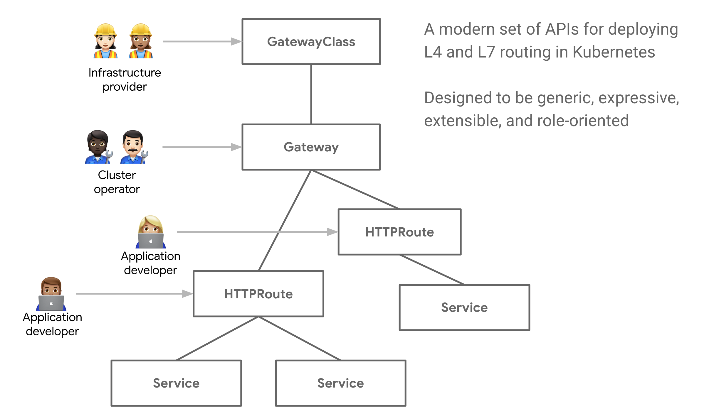

# What is the Gateway API? 
Gateway API is an open source project managed by the SIG-NETWORK community. It is a collection of resources that model service networking in Kubernetes. These resources - GatewayClass,Gateway, HTTPRoute, TCPRoute, Service, etc - aim to evolve Kubernetes service networking through expressive, extensible, and role-oriented interfaces that are implemented by many vendors and have broad industry support

## GatewayClasses 
GatewayClasses formalize types of load balancing implementations. These classes make it easy and explicit for users to understand what kind of capabilities are available via the Kubernetes resource model.

## Shared Gateways and cross-Namespace support
They allow the sharing of load balancers and VIPs by permitting independent Route resources to attach to the same Gateway. This allows teams (even across Namespaces) to share infrastructure safely without direct coordination.

## Typed Routes and typed backends
The Gateway API supports typed Route resources and different types of backends. This allows the API to be flexible in supporting various protocols (like HTTP and gRPC) and various backend targets (like Kubernetes Services, storage buckets, or functions).

