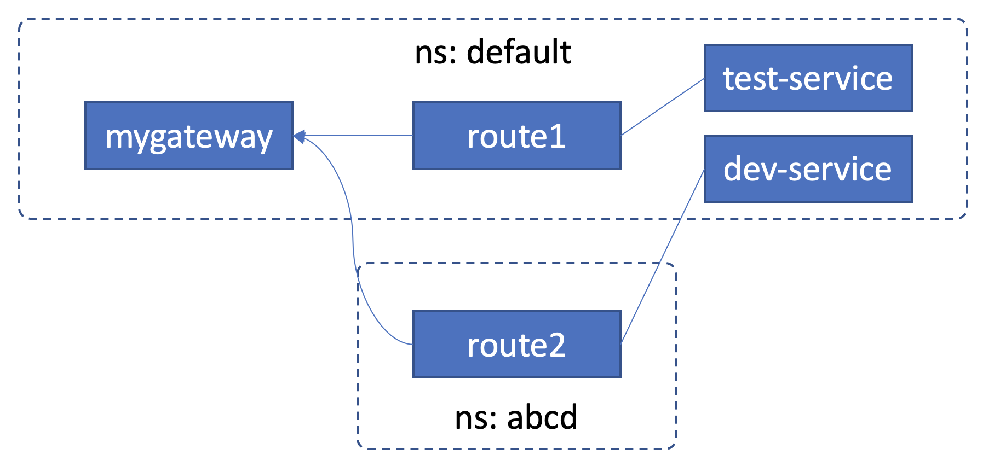

## Gateway and Route Attachment Spec: AllowedRoutes

*Supported from v0.1.1*

> Note: The full deployment yaml files can be found:

* [*pre.yaml*](./cross-ns-demo/pre.yaml): the `GatewayClass` "bigip" and the `Namespace` "abcd"

* [*api.yaml*](./cross-ns-demo/api.yaml): the `Gateway` "mygateway" and `HTTPRoute`s "route1" and "route2"

* [*svc.yaml*](./cross-ns-demo/svc.yaml): the `Service`s "test-service" and "dev-service"

As the [SIG GatewayAPI](https://gateway-api.sigs.k8s.io/){:target="_blank"} mentioned at the beginning of the [page](https://gateway-api.sigs.k8s.io/guides/multiple-ns/#cross-namespace-route-attachment){:target="_blank"}: 

"*The Gateway API has core support for cross Namespace routing. This is useful when more than one user or team is sharing the underlying networking infrastructure, yet control and configuration must be segmented to minimize access and fault domains.*

*Gateways and Routes can be deployed into different Namespaces and Routes can attach to Gateways across Namespace boundaries. This allows user access control to be applied differently across Namespaces for Routes and Gateways, effectively segmenting access and control to different parts of the cluster-wide routing configuration. The ability for Routes to attach to Gateways across Namespace boundaries are governed by Route Attachment. Route attachment is explored in this guide and demonstrates how independent teams can safely share the same Gateway.*".

In summary, a route can be attached to a gateway under another namespace. This attachment is restricted by the "AllowedRoutes" field in the listener definition of the gateway.

It is highly recommended that you read the official website's interpretation of [Cross-Namespace Routing Usecase](https://gateway-api.sigs.k8s.io/guides/multiple-ns){:target="_blank"}.

In this page, we focus on 9 cases of configuration practices of `AllowedRoutes`. 

To demonstrate the configurations, we have a `Gateway` named "mygateway", 2 `HTTPRoute`s named "route1" and "route2" and 2 `Service`s named "test-service" and "dev-service". 



"route2" is in a different namespace as shown in the above figure. It can be attached to "mygateway" only when the `AllowedRoutes` in "mygateway" is configured ***right***.

In the 2 `HTTPRoute`s, the `parentRefs` defines the attaching `Gateway`'s listener:

```yaml
spec:
  parentRefs:
    - namespace: default
      name: mygateway
      sectionName: listenerx
```

*Refer [here](./cross-ns-demo/api.yaml) for the full definition of "route1" and "route2", and [here](./cross-ns-demo/svc.yaml) for `Service`'s definitions.*

The `Gateway`: "mygateway" definition is:

```yaml
---

apiVersion: gateway.networking.k8s.io/v1beta1
kind: Gateway
metadata:
  name: mygateway
  labels:
    domain: k8s-gateway
spec:
  gatewayClassName: bigip
  listeners:
  - name: listenerx
    port: 80
    protocol: HTTP

    # 1. no "allowedRoutes" definition
    # 

    # 2. from all namespaces 
    # allowedRoutes:
    #   namespaces:
    #     from: All
    
    # 3. from same namespace
    # allowedRoutes:
    #   namespaces:
    #     from: Same

    # 4. use selector's matchLabels
    # allowedRoutes:
    #   namespaces:
    #     from: Selector
    #     selector:
    #       matchLabels:
    #         resource.zone: allowed-namespaces
    
    # 5. use selector's matchExpressions
    # allowedRoutes:
    #   namespaces:
    #     from: Selector
    #     selector:
    #       matchExpressions:
    #         - key: resource.zone
    #           operator: In
    #           values:
    #             - allowed-namespaces
    
    # 6. use kinds = []
    # allowedRoutes:
    #   kinds: []

    # 7. use kinds with items specified -- no HTTPRoute
    # allowedRoutes:
    #   kinds:
    #     - kind: TLSRoute
    #     - kind: TCPRoute

    # 8. use kinds with items specified -- has HTTPRoute
    # allowedRoutes:
    #   kinds:
    #     - group: gateway.networking.k8s.io
    #       kind: HTTPRoute
    #     - kind: TCPRoute
    #       # group defaults to "gateway.networking.k8s.io"

    # 9. use kinds with items specified -- group is ingress
    # allowedRoutes:
    #   kinds:
    #     - group: ingress.networking.k8s.io
    #       kind: HTTPRoute
  addresses:
    - value: 10.250.18.119
```

*Refer [here](./cross-ns-demo/pre.yaml) for `GatewayClass` and namespace `abcd` definition.*

We have 9 cases of configurations above:

```yaml
    # 1. no "allowedRoutes" definition
    # 
```
When there is no `allowedRoutes` defined in the `Listener` of `Gateway`, the `AllowedRoutes` defaults to **from: Same and kinds: HTTP**, that means only "route1" from "default" namespace can be mounted to "mygateway".

Refer to [`AllowedRoutes` Spec](https://github.com/kubernetes-sigs/gateway-api/blob/v0.5.1/apis/v1beta1/gateway_types.go#L369){:target="_blank"} for more "default" details:
* namespaces: *"This is restricted to the namespace of this Gateway by default."*
* kinds: *"When unspecified or empty, the kinds of Routes selected are determined using the Listener protocol."*

```yaml
    # 2. from all namespaces
    # allowedRoutes:
    #   namespaces:
    #     from: All
```
When `namespaces` is set "All", both "route1" and "route2" can be attached. That means `HTTPRoute` from any namespaces can be attached to "mygateway".

```yaml
    # 3. from same namespace 
    # allowedRoutes:
    #   namespaces:
    #     from: Same
```

This case is as same as case 1, only `HTTPRoute` "route1" from "default" namespace  can be attached.

```yaml
    # 4. use selector's matchLabels
    # allowedRoutes:
    #   namespaces:
    #     from: Selector
    #     selector:
    #       matchLabels:
    #         resource.zone: allowed-namespaces
```

The label "resource.zone: allowed-namespaces" matches `Namespace` "abcd", so only "route2" from "abcd" namespace can be attached.

```yaml
    # 5. use selector's matchExpressions
    # allowedRoutes:
    #   namespaces:
    #     from: Selector
    #     selector:
    #       matchExpressions:
    #         - key: resource.zone
    #           operator: In
    #           values:
    #             - allowed-namespaces
```

It have the same effect with case 4, however, it have more filtering options than `matchLabels`. See [here](https://kubernetes.io/docs/reference/generated/kubernetes-api/v1.23/#labelselector-v1-meta){:target="_blank"} for more details about `LabelSelector`.

```yaml
    # 6. use kinds = []
    # allowedRoutes:
    #   kinds: []
```

When `kinds` is an empty list, the `namespaces` will default to `Same`, and the kind match default to same protocol, that means "mygateway" `Listener` "listenerx"'s `HTTP` protocol must match route's type `HTTPRoute`.

```yaml
    # 7. use kinds with items specified -- no HTTPRoute
    # allowedRoutes:
    #   kinds:
    #     - kind: TLSRoute
    #     - kind: TCPRoute
```

There's no match for `HTTPRoute`, so no route will be attached to "mygateway".


```yaml
    # 8. use kinds with items specified -- has HTTPRoute
    # allowedRoutes:
    #   kinds:
    #     - group: gateway.networking.k8s.io
    #       kind: HTTPRoute
    #     - kind: TCPRoute
    #       # group defaults to "gateway.networking.k8s.io"
```

`HTTPRoute` matches "route1" and "route2", but only "route1" from the same namespace can be attached to "mygateway".

```yaml
    # 9. use kinds with items specified -- group is ingress
    # allowedRoutes:
    #   kinds:
    #     - group: ingress.networking.k8s.io
    #       kind: HTTPRoute
```

`group` name is not matched. Only `gateway.network.k8s.io` is supported.

You may also get the video demonstration:
[video](https://youtu.be/GM0KYZ2IIGo).
